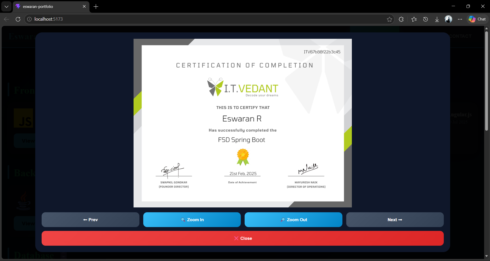
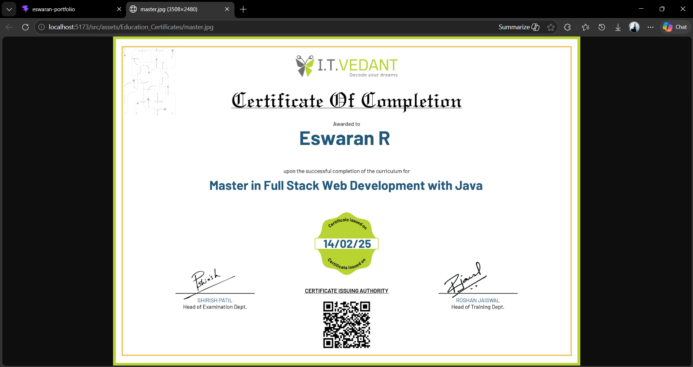

# 🌐 ESWARAN Professional Portfolio

<p align="center">
  
</p>

<p align="center">
  💼 Java Full Stack Developer <br/>
  🚀 Modern Portfolio Website using React.js + Vite
</p>

<p align="center">
  <a href="https://eswaran-resume-website.netlify.app">🔗 Live Demo</a> |
  <a href="https://github.com/Eswaran0908/eswaran-professional-portfolio">📂 GitHub Repository</a>
</p>

---

## 📌 About Project

A modern and fully responsive **Personal Portfolio Website** built to showcase my professional profile as a **Java Full Stack Developer**.

### 🎯 Includes:

✅ Skills Showcase  
✅ Projects Portfolio  
✅ Certificates Gallery  
✅ Education Section  
✅ Resume Download  
✅ Contact Form  
✅ Mobile Responsive Design

---

## 🚀 Tech Stack

| Technology | Usage |
|-----------|-------|
| ⚛️ React.js | Frontend |
| ⚡ Vite | Build Tool |
| 🎨 CSS3 | Styling |
| 💻 JavaScript | Functionality |
| 📧 EmailJS | Contact Form |
| 🌐 Netlify | Deployment |

---

## ✨ Features

✅ Beautiful UI Design  
✅ Fully Responsive Layout  
✅ Animated Navbar  
✅ Resume Download Button  
✅ Contact Form with EmailJS  
✅ Popup Image Viewer  
✅ Zoom In / Zoom Out  
✅ Projects Live Links  
✅ GitHub & LinkedIn Links  
✅ Mobile Hamburger Menu

---

# 📸 Website Preview

## 🏠 Home Page


---

## 👨‍💻 About Page


---

## 🚀 Projects Page


---

## 🏆 Certificates Page


---

## 🔍 Certificate Popup Viewer



---

## 🎓 Education Page


---

## 🔍 Certificate Popup Viewer



---


## 📬 Contact Page


---

## 📱 Mobile Responsive View


---

# 📂 Full Folder Structure

```bash
ESWARAN-PROFESSIONAL-PORTFOLIO/
│── public/
│   ├── bg-image.webp
│   ├── ESWARAN.R.pdf
│   ├── favicon.svg
│   ├── icons.svg
│   └── master.png
│
│── src/
│   ├── assets/
│   │   ├── Education_Certificates/
│   │   ├── icons/
│   │   │   ├── technologies/
│   │   │   └── tools/
│   │   ├── Learning_proofs/
│   │   ├── List_Certificates/
│   │   ├── List_Projects/
│   │   ├── eswaran.jpg
│   │   ├── hero.png
│   │   └── master.png
│   │
│   ├── components/
│   │   ├── Navbar.jsx
│   │   ├── Home.jsx
│   │   ├── About.jsx
│   │   ├── Projects.jsx
│   │   ├── Certificates.jsx
│   │   ├── Education.jsx
│   │   ├── Contact.jsx
│   │   ├── Footer.jsx
│   │   ├── Navbar.css
│   │   ├── Home.css
│   │   ├── About.css
│   │   ├── Projects.css
│   │   ├── Certificates.css
│   │   ├── Education.css
│   │   ├── Contact.css
│   │   └── Footer.css
│   │
│   ├── Work-Result/
│   │   ├── 1-home.png
│   │   ├── 2-about.png
│   │   ├── 3-projects.png
│   │   ├── 4-certificates.png
│   │   ├── 4.1-view.png
│   │   ├── 5-education.png
│   │   └── 5.1-view.png
│   │   ├── 6-contact.png
│   │   └── small_device_view.png
│   │
│   ├── App.jsx
│   ├── App.css
│   ├── index.css
│   └── main.jsx
│
│── package.json
│── package-lock.json
│── vite.config.js
│── README.md


Deployment

🚀 Hosted on Netlify

👨‍💻 Author

Eswaran R
💼 Java Full Stack Developer

📧 Email: eswaranraja555@gmail.com

📱 Phone: +91 6361232640
🌐 GitHub: https://github.com/Eswaran0908

💼 LinkedIn: https://linkedin.com/in/eswaran0908

⭐ Support

If you like this project, give it a ⭐ on GitHub.

🙏 Thank You

Thanks for visiting my portfolio project 💙