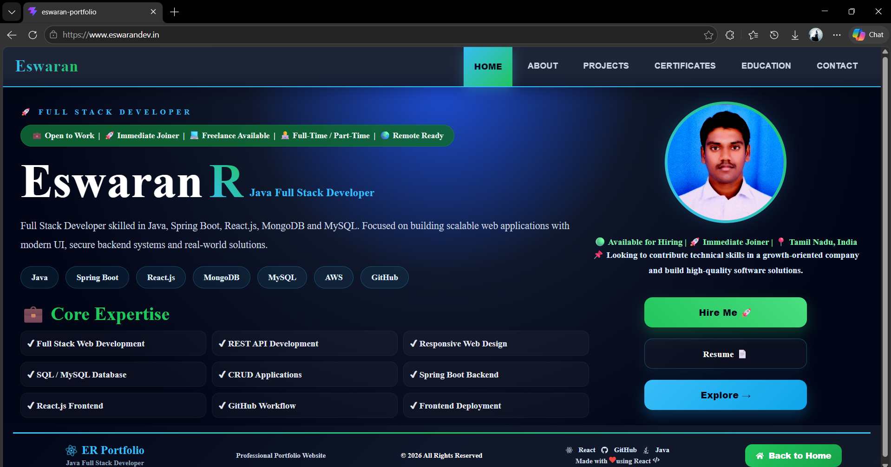
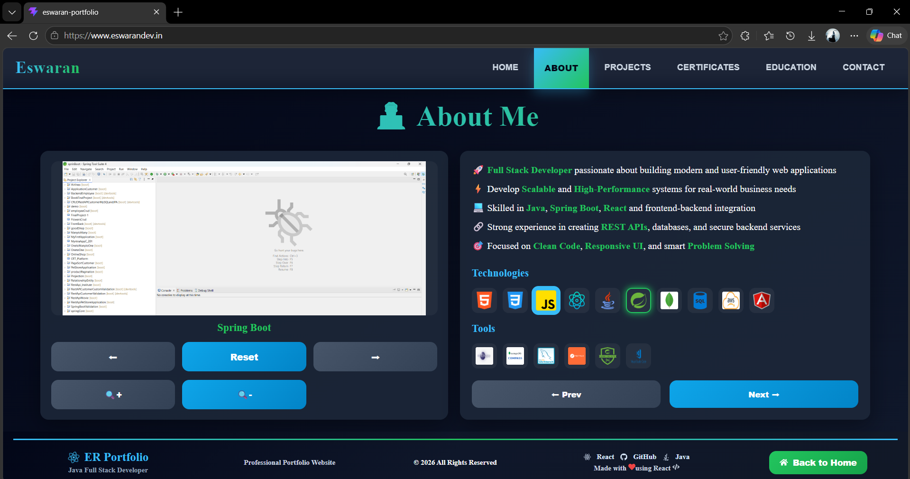
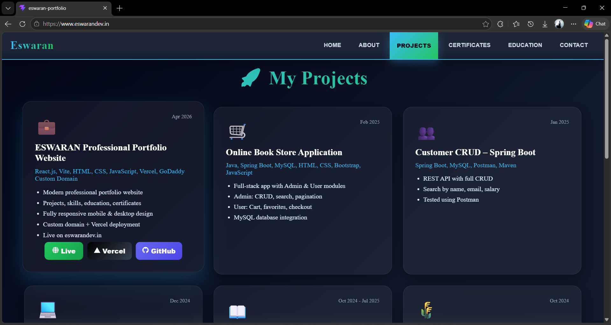
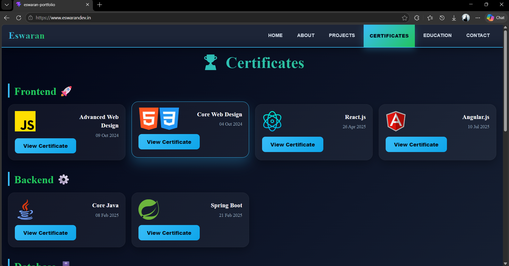
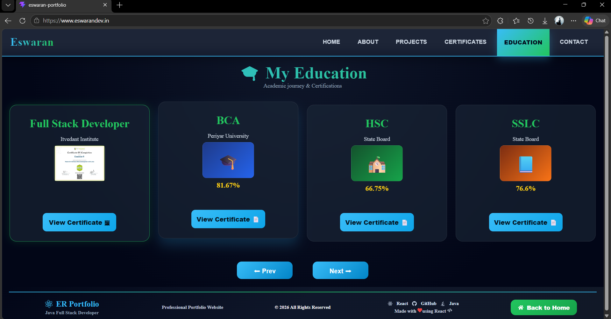
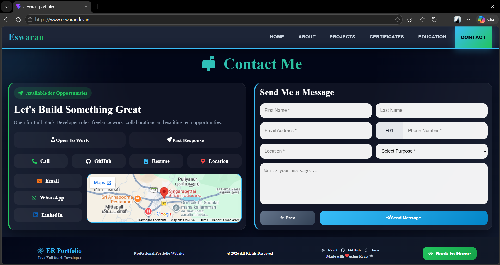
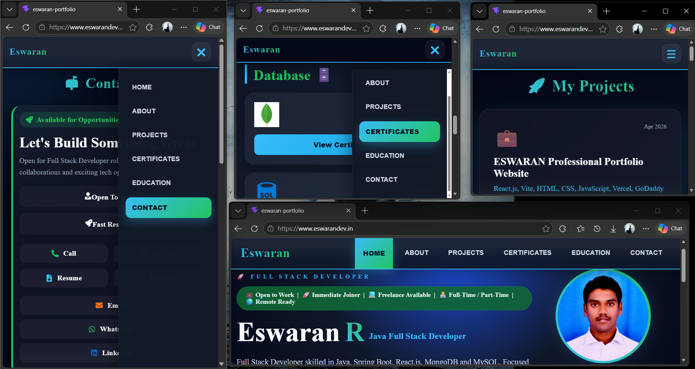

# 🌐 ESWARAN Professional Portfolio

<p align="center">
  
</p>

<p align="center">
  💼 Java Full Stack Developer <br/>
  🚀 Modern Portfolio Website using React.js + Vite
</p>

<p align="center">
  <a href="https://eswarandev.in" target="_blank">🔗 Live Website</a> |
  <a href="https://eswaran-professional-portfolio.vercel.app" target="_blank">⚡ Vercel Live Demo</a> |
  <a href="https://github.com/Eswaran0908/eswaran-professional-portfolio" target="_blank">📂 GitHub Repository</a>
</p>

---

# 📌 About Project

A modern, responsive and professional **Personal Portfolio Website** built to showcase my profile as a **Java Full Stack Developer**.

This project highlights my:

✅ Skills  
✅ Projects  
✅ Certifications  
✅ Education  
✅ Resume  
✅ Contact Details

---

# 🚀 Live Links

| Platform | Link |
|--------|------|
| 🌍 Custom Domain | https://eswarandev.in |
| ⚡ Vercel | https://eswaran-professional-portfolio.vercel.app |
| 💻 GitHub Repo | https://github.com/Eswaran0908/eswaran-professional-portfolio |

---

# 🛠️ Tech Stack

| Technology | Usage |
|-----------|------|
| ⚛️ React.js | Frontend UI |
| ⚡ Vite | Fast Build Tool |
| 🎨 CSS3 | Styling |
| 💻 JavaScript | Logic |
| 📧 EmailJS | Contact Form |
| ▲ Vercel | Deployment |
| 🌐 GoDaddy | Custom Domain |

---

# ✨ Features

✅ Fully Responsive Design  
✅ Modern UI Layout  
✅ Smooth Navigation  
✅ Hero Section  
✅ About Me Section  
✅ Skills Showcase  
✅ Projects Gallery  
✅ Certificates Section  
✅ Education Section  
✅ Resume Download  
✅ Contact Form with EmailJS  
✅ GitHub / LinkedIn Links  
✅ Mobile Menu  
✅ Fast Performance

---

# 📸 Website Preview

## 🏠 Home Page



---

## 👨‍💻 About Section



---

## 🚀 Projects Section



---

## 🏆 Certificates Section



---

## 🎓 Education Section



---

## 📬 Contact Section



---

## 📱 Mobile Responsive View



---

# 📂 Project Folder Structure

```bash
ESWARAN-PROFESSIONAL-PORTFOLIO/
│── public/
│   ├── bg-image.webp
│   ├── ESWARAN.R.pdf
│   ├── favicon.svg
│   └── master.png
│
│── src/
│   ├── assets/
│   ├── components/
│   ├── Work-Result/
│   ├── App.jsx
│   ├── App.css
│   ├── index.css
│   └── main.jsx
│
│── package.json
│── vite.config.js
│── README.md
---

# 🚀 Deployment

🌐 Live Website: https://eswarandev.in

⚡ Hosted on Vercel

🔗 Vercel URL: https://eswaran-professional-portfolio.vercel.app

🛒 Custom Domain Managed via GoDaddy

---

# 👨‍💻 Author

## Eswaran R

💼 Java Full Stack Developer

📧 Email: eswaranraja555@gmail.com

📱 Phone: +91 6361232640

🌐 Portfolio: https://eswarandev.in

💻 GitHub: https://github.com/Eswaran0908

💼 LinkedIn: https://linkedin.com/in/eswaran0908

---

# ⭐ Support

If you like this project, give it a ⭐ on GitHub.

---

# 🙏 Thank You

Thanks for visiting my portfolio project 💙